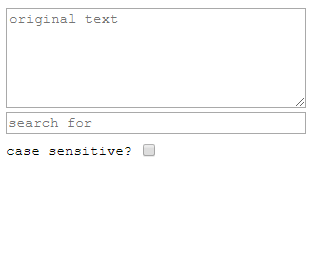

Task
====

This challenge involves coding a simple component to highlight substrings of text provided by a user of the web app.

Your component should create four elements for the testing suite to manipulate using `data-testid` attributes:

* `<textarea data-testid="source-text" />`: a field for the user to input the contents of the text they'd like to search in.
* `<input data-testid="search-term" />`: a field for the user to input the substring within `source-text` that they'd like to highlight all instances of.
* `<input type="checkbox" data-testid="case-sensitive" />`: a checkbox that toggles whether a search should be case sensitive or not. When checked, the search is case sensitive, and when not checked, the search ignores case. This element should be unchecked by default.
* `

`: an element to contain the result HTML. Within this element, all instances of the search term should be surrounded by `<mark></mark>` tags. For example, if the `source-text` element's content is the text `hello world!` and the `search-term` element's content is the text `o`, the result element should be set to the HTML string:

        hell<mark>o</mark> w<mark>o</mark>rld!

    Updates to the result should happen whenever any changes are made to any of the input elements.

As a simplifying assumption when rendering your output, you can assume that whitespace in any input field will consist of spaces only (no tabs or newlines), and there will not be more than a single space consecutively. In other words, your test suite will not evaluate your application on input like:

    hello    world

or

    hello
    world

The test suite will not attempt to throw your matcher for a loop in terms of overlapping search terms, but if in doubt, you can be greedy: if the `source-text` value is `aaaaaaa` and the `search-term` is `aaa`, the output can be `<mark>aaa</mark><mark>aaa</mark>a`. In other words, as soon as you find a match, mark it and disregard it in the remaining substring (don't backtrack or attempt to highlight overlaps).

* * *

Demo
----

Here's a screen capture of the finished component exhibiting the desired behavior:

* * *
